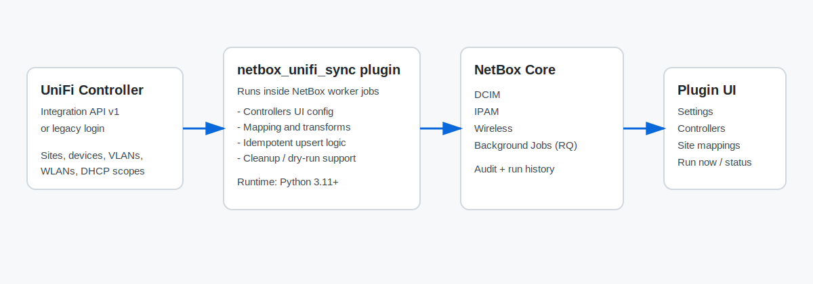
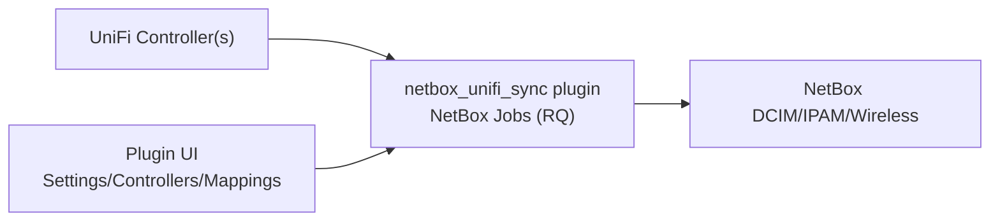

# netbox_unifi_sync

`netbox_unifi_sync` is a NetBox 4.2+ plugin that runs UniFi -> NetBox sync jobs inside NetBox workers.

## Visual Overview





## Features

- Device sync (devices, interfaces, VLANs, prefixes, WLANs, uplink relations, IP assignments)
- DHCP scope sync to NetBox IP Ranges
- UniFi auth via API key or legacy login (username/password + optional MFA)
- Manual and scheduled sync jobs
- Runtime settings stored in plugin models (`Settings`, `Controllers`, `Site mappings`)

## Quick Start

### 1. Install

```bash
pip install netbox-unifi-sync
```

PyPI project page: <https://pypi.org/project/netbox-unifi-sync/>

For `netbox-docker`, add the package to `local_requirements.txt` before build:

```bash
echo "netbox-unifi-sync" >> local_requirements.txt
```

### 2. Enable plugin in NetBox

```python
PLUGINS = ["netbox_unifi_sync"]

PLUGINS_CONFIG = {
    "netbox_unifi_sync": {}
}
```

### 3. Apply migrations

```bash
python manage.py migrate
```

### 4. Configure in UI

Go to `Plugins -> UniFi Sync` and configure:

1. `Settings` (`tenant_name`, `netbox_roles`, defaults)
2. `Controllers` (URL, auth mode, credentials)
3. `Site mappings` (if UniFi/NetBox site names differ)

### 5. Run first sync

- UI: `Plugins -> UniFi Sync -> Sync Dashboard -> Run now`
- CLI:

```bash
python manage.py netbox_unifi_sync_run --dry-run --json
python manage.py netbox_unifi_sync_run --cleanup
```

## Credentials

Set credentials only in `Plugins -> UniFi Sync -> Controllers`.
Do not store UniFi credentials in `PLUGINS_CONFIG`.

## Documentation

- [Server install guide](docs/server-install.md)
- [NetBox plugin mode](docs/netbox-plugin.md)
- [Configuration reference](docs/configuration.md)
- [Troubleshooting](docs/troubleshooting.md)
- [Release and PyPI publish](docs/release.md)
- [netbox-docker setup](deploy/netbox-docker/README.md)
- [Wiki source pages](wiki/Home.md)
- [GitHub Wiki](https://github.com/unifi2netbox/netbox-unifi-sync/wiki)

## Security Notes

- SSL verification defaults to `true`
- Secrets are redacted in run history and audit logs
- Timeouts/retries/backoff are configurable

## Maintainer: Release to PyPI

1. Bump version in:
   - `pyproject.toml` (`[project].version`)
   - `netbox_unifi_sync/version.py` (`__version__`)
2. Configure PyPI Trusted Publisher (OIDC) for this repository/workflow.
3. Create and push tag `vX.Y.Z`:
   - `git tag -a vX.Y.Z -m "Release vX.Y.Z"`
   - `git push origin vX.Y.Z`
4. `release.yml` creates GitHub Release.
5. `publish-python-package.yml` publishes package to PyPI when release is published.
