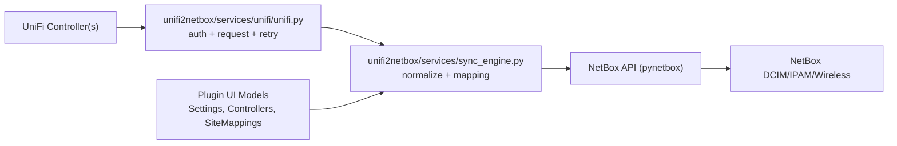
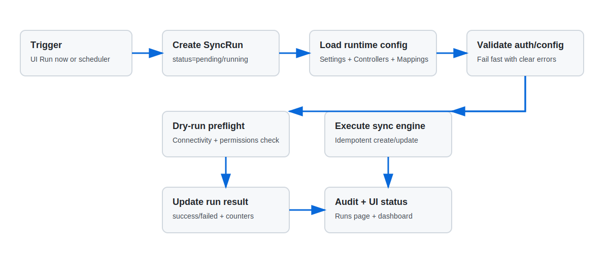
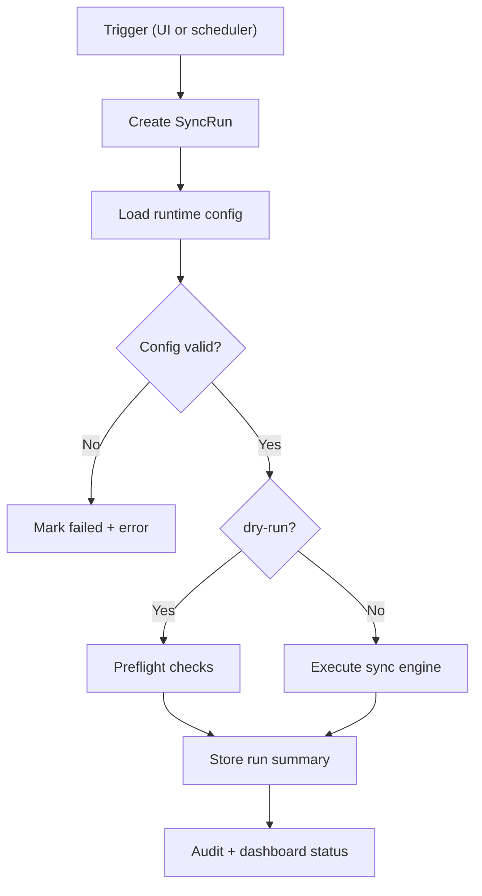

# Architecture

## Overview




## API Compatibility

### Integration API (v1)

- Uses `UNIFI_API_KEY`
- Base URL candidates are auto-probed:
  - `<base>/proxy/network/integration/v1`
  - `<base>/integration/v1`
  - or direct URL if already ending with `/integration/v1`
- Header formats are auto-probed (`X-API-KEY`, `Authorization`, or custom `UNIFI_API_KEY_HEADER`)
- `Sites` and resource pagination are handled with `offset`/`limit`
- `unifi.ui.com` cloud API keys are not treated as local Integration API keys

### Session login (UniFi OS / legacy)

- Uses `UNIFI_USERNAME` + `UNIFI_PASSWORD` (+ optional `UNIFI_MFA_SECRET`)
- Login endpoints are auto-tried:
  - `/api/auth/login` (UniFi OS)
  - `/api/login` (legacy)
- Uses cookie session and optional CSRF token
- Session metadata is cached in `~/.unifi_session.json` with file mode `0600` (and auto-tightened if existing file permissions are too open)

## Request Behavior

- Retryable status codes: `408, 425, 429, 500, 502, 503, 504`
- Exponential backoff controlled by:
  - `UNIFI_HTTP_RETRIES`
  - `UNIFI_RETRY_BACKOFF_BASE`
  - `UNIFI_RETRY_BACKOFF_MAX`
- `Retry-After` is honored when present
- Request timeout: `UNIFI_REQUEST_TIMEOUT`

## Parallelism Model

```text
Controller pool (MAX_CONTROLLER_THREADS)
  -> Site pool (MAX_SITE_THREADS)
    -> Device pool (MAX_DEVICE_THREADS)
```

Default thread limits:
- controller: `5`
- site: `8`
- device: `8`

## Shared Caches / Locks

Main thread-safe structures in `unifi2netbox/services/sync_engine.py`:
- `vrf_cache` + per-name locks
- `_custom_field_cache`
- `_tag_cache`
- `_vlan_cache`
- `_cleanup_serials_by_site`
- `_unifi_dhcp_ranges`
- `postable_fields_cache`

## Sync Flow (high-level)

1. Load runtime config from plugin models (`Settings`, `Controllers`, `Site mappings`)
2. Merge optional non-secret bootstrap defaults from `PLUGINS_CONFIG["netbox_unifi_sync"]`
3. Resolve NetBox tenant/roles/sites
4. Process all configured UniFi controllers in parallel
5. Per site:
   - sync devices
   - sync interfaces/VLANs/WLANs/cables (feature toggles)
   - optional DHCP-to-static conversion (updates UniFi device IP config)
6. Optional cleanup (`cleanup_enabled=true`)
7. Repeat if scheduler is enabled and interval is configured





## Runtime Security-Relevant Defaults

- UniFi TLS verification is controlled by `UNIFI_VERIFY_SSL` (default `true`)
- NetBox TLS verification is controlled by `NETBOX_VERIFY_SSL` (default `true`)
- UniFi session persistence is controlled by `UNIFI_PERSIST_SESSION` (default `true`)
- UniFi credentials are sourced from `Controllers` UI fields (`api_key_ref`, `username_ref`, `password_ref`, `mfa_secret_ref`)
