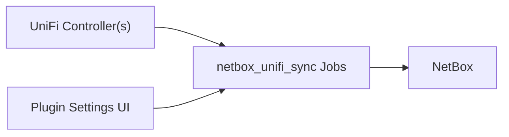

# netbox_unifi_sync

Production-focused UniFi -> NetBox synchronization as an in-platform NetBox plugin.

## Documentation

- [Server Install Guide](./server-install.html)
- [NetBox Plugin Mode](./netbox-plugin.html)
- [Configuration](./configuration.html)
- [Architecture](./architecture.html)
- [Troubleshooting](./troubleshooting.html)
- [FAQ](./faq.html)
- [Cleanup](./cleanup.html)
- [Device Specs](./device-specs.html)
- [Release & PyPI Publish](./release.html)
- [QA Checklist](./qa-checklist.html)
- [Bug Report](./bug-report.html)

## Visuals

## Notes

- Primary sync direction is UniFi -> NetBox.
- DHCP-to-static conversion can update UniFi device IP settings when enabled.
- Local UniFi Integration API keys are supported; `unifi.ui.com` cloud keys are not drop-in compatible.
